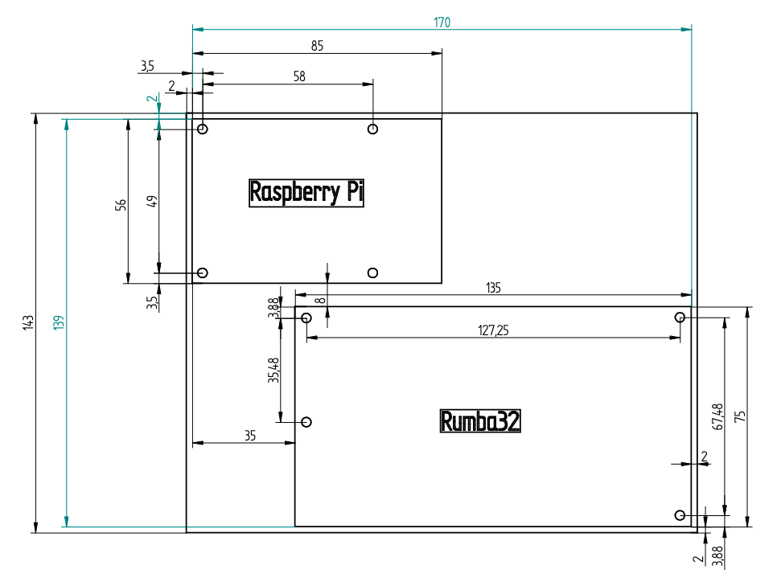
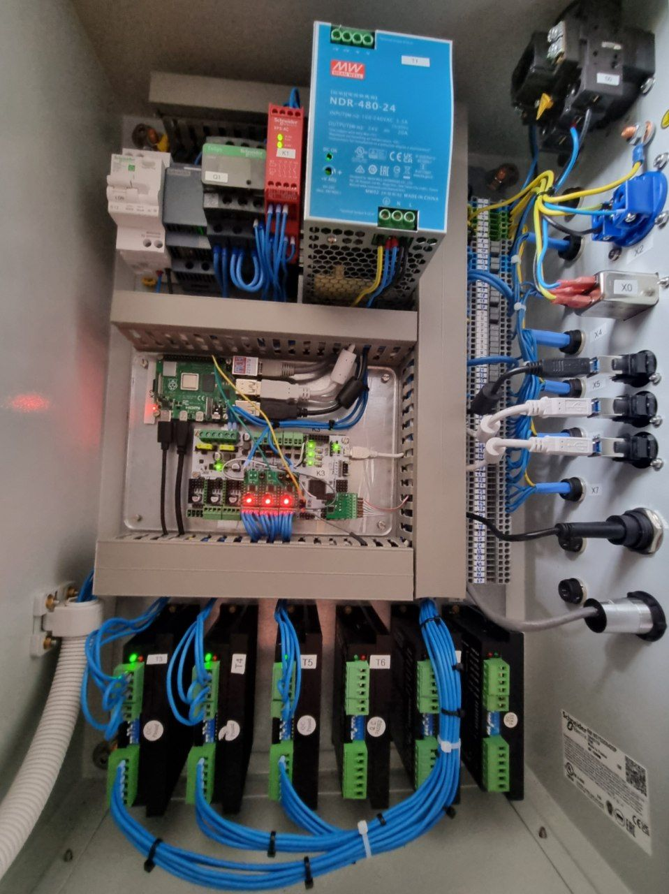

# COSI Measure Electronic Controls

In this folder are all the files you need to rebuild the electronic cabinet of COSI Measure. In every subfolder is a README.md as a landing page with detailed information on every subsystem.

# Building Instructions

1. Buy all needed stuff, see [bom-electronic-cabinet.csv](bom-electronic-cabinet.csv).  Keep in mind that there are some things missing that most of the labs have laying around e.g. screws, cables...

2. Machine all holes in the enclosure and the door, see drawings below      

3. Build and mount the baseplate for Rumba32 and RaspberryPi, see drawing below   

4. Mount all devices to the baseplate (see picture below) and the door.   

5. Build the breakoutboards, see [Levelshifter](Rumba32/Endstop_Levelshifter/README.md) and [Driver Breakoutboards](Rumba32/Driver_BreakoutBoard/README.md). Place them into the Rumba32 board.

6. mount all devices to the door and the side of the enclosure

7. Wire PE, see [schematics](schematics/README.md). Use green-yellow wire for that.

8. Wire everything else, see [schematics](schematics/README.md). Keep in mind all applicable (local) regulations. 24 V DC is wired in dark blue. 230 V AC is wired in black, the neutral wire is light blue. The 24 V power supply delivers 480 watts, so be aware to choose matching cable diameters.

9. Commissioning: 
    1. connect the machine to the enclosure. 
    2. unplug the USB power supply of the RaspberryPi!
    3. ensure/ measure that the PE is correct
    4. connect to mains
    5. ensure and test that all safety related things are working properly, e.g. that the safe-torque-off (emergency stop) is working correct
    6. Set the DIP-switches of the motor drivers:

        For T3:

        | Switch # | Comment           | Switch Position |
        |----------|-------------------|-----------------|
        | SW1      | Current Setting   | ON              |
        | SW2      | Current Setting   | ON              |
        | SW3      | Current Setting   | OFF             |
        | SW4      | Halt Current      | OFF             |
        | SW5      | Microstep Setting | ON              |
        | SW6      | Microstep Setting | OFF             |
        | SW7      | Microstep Setting | OFF             |
        | SW8      | Microstep Setting | ON              | 

        For T4:

        | Switch # | Comment           | Switch Position |
        |----------|-------------------|-----------------|
        | SW1      | Current Setting   | ON              |
        | SW2      | Current Setting   | ON              |
        | SW3      | Current Setting   | OFF             |
        | SW4      | Halt Current      | OFF             |
        | SW5      | Microstep Setting | ON              |
        | SW6      | Microstep Setting | OFF             |
        | SW7      | Microstep Setting | OFF             |
        | SW8      | Microstep Setting | ON              | 

        For T5:

        | Switch # | Comment           | Switch Position |
        |----------|-------------------|-----------------|
        | SW1      | Current Setting   | OFF             |
        | SW2      | Current Setting   | OFF             |
        | SW3      | Current Setting   | ON              |
        | SW4      | Halt Current      | OFF             |
        | SW5      | Microstep Setting | ON              |
        | SW6      | Microstep Setting | OFF             |
        | SW7      | Microstep Setting | OFF             |
        | SW8      | Microstep Setting | ON              | 
    
        You can later tune the [microstepping](https://www.analog.com/en/lp/001/optimizing-stepper-motors-microstepping.html) and the motor currents to your setup. The table above might be a good starting point.  Keep in mind: If you change the microstep settings on the motor drivers, you also need to change it in the [printer.cfg](../software/backend/printer.cfg)-file. 
        A higher microstep setting reduces the holding torque which can be compensated by more current. Having too much microsteps per full step with not enough current leads to less precise movement and increased oscillation. More info on that: https://www.monolithicpower.com/why-microstepping-isnt-as-good-as-you-think

    6. Turn off the main switch, wait until the 5V powersupply is discharged and then put back the USB power supply to RaspberryPi. Now you are ready to start with the [software](../Software/README.md).

