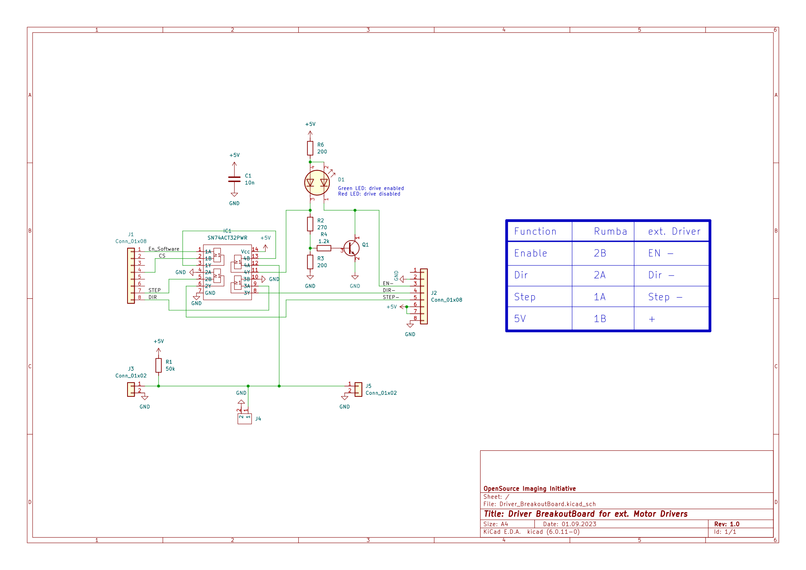
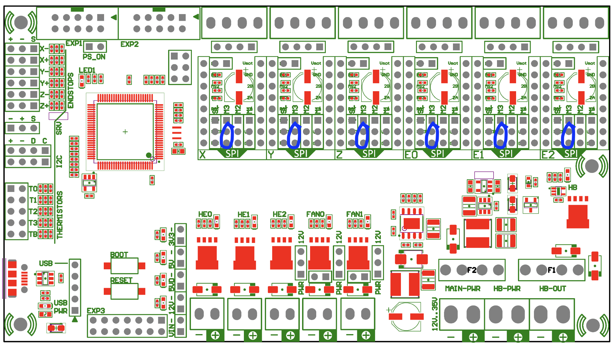

# Driver Breakout Board

<!-- TOC -->

- [Driver Breakout Board](#driver-breakout-board)
    - [Enable Logic](#enable-logic)
    - [Schematic](#schematic)
    - [BOM](#bom)
    - [Setting jumpers on Rumba32](#setting-jumpers-on-rumba32)
        - [STEPPER_DRIVER_LOGIC JUMPER](#stepper_driver_logic-jumper)
        - [Additional Software Enable Jumpers](#additional-software-enable-jumpers)

<!-- /TOC -->

This breakoutboard can be placed to the motor driver slots into the Rumba32 board. 
It is useful for wiring the step, direction and enable pins via the motor connector to external motor drivers. In addition it supports an easy way of integrating a drive-enable functionality.

## Enable Logic

There can be current on the drives, if 
- The Firmware enables the drives and
- some control pins are low (furhter explanation below) and
- Emergency Stop Relais provides it's NPN-ok signal ($0 \ V$).
- Contactor -Q1 is closed (no safe-torque-off)

Many 3D-printing firmwares are not designed for switching off the drives completly while executing a G-code file. But COSI-Measure is meant to perform magnetic measurements, so it must not disturb the measurements with noisy motor currents while performing a measurement.

A convenient workaround for Klipper is to switch on and off some extra GPIO Pins, that are wired to the hardware-enable-logic. In case you are doing something different and you do not need this feature, feel free to ignore it. Default of these Pins is low, which is also the enabled state. For details about it see the [printer.cfg](../../../software/backend/printer.cfg) file line 275-317. The drives can be enabled and disabled with g-code macros while keeping the homing active.

The NPN-ok-signal from the emergency stop relais can be daisy-chained with standard 2.54 mm jumpers to the next breakout board.

The enable input of the motordriver is not meant for a safe-torque-off function (emergency stop). Safe-torque-off is implemented in hardware (mechanical relais, contactors etc.), see [schematics](../../schematics/README.md#emergencystop). 
Anyway, to prevent driver malfunction the driver will be disabled with semiconductor only circuits before the power supply of the driver will be disconnected. The delay is coming from the slower reaction of mechanical contactors and relais, so no dedicated timing module is needed.

## Schematic

## BOM

This Bill-of-Materials is for 1 breakout board only. You need one breakout board for each motor with external motor drivers, usually 3 in total (depending to your setup).

| #  | Designator | Quantity | Comment              | Man. Part-No       | Link                                                                                            |
|----|------------|----------|----------------------|--------------------|-------------------------------------------------------------------------------------------------|
| 1  | C1         | 1        | 10 nF, 0805          | C0805C103K2RECAUTO | <https://www.digikey.de/de/products/detail/kemet/C0805C103K2RECAUTO/8646745>                    |
| 2  | D1         | 1        | Dual LED red/green   | AAA3528ESGCT       | <https://www.digikey.de/de/products/detail/kingbright/AAA3528ESGCT/7318936>                     |
| 3  | IC1        | 1        | OR-Gate              | SN74ACT32PWR       | <https://www.digikey.de/en/products/detail/texas-instruments/SN74ACT32PWR/376063>               |
| 4  | J1, J2     | 2        | 8 pin header 2.54    | 61300811121        | <https://www.digikey.de/de/products/detail/w%C3%BCrth-elektronik/61300811121/4846839>           |
| 5  | J3, J5     | 2        | 2 pin header 2.54    | 61300211121        | <https://www.digikey.de/de/products/detail/w%C3%BCrth-elektronik/61300211121/4846823>           |
| 6  | J4         | 1        | 2 pos screw terminal | 0393570002         | <https://www.digikey.de/de/products/detail/molex/0393570002/946543>                             |
| 7  | Q1         | 1        | NPN Transistor       | MMBT3904           | <https://www.digikey.de/de/products/detail/micro-commercial-co/MMBT3904-TP/717280>              |
| 8  | R1         | 1        | 47 kOhm, 0805        | WR08X473 JTL       | <https://www.digikey.de/de/products/detail/walsin-technology-corporation/WR08X473-JTL/13240617> |
| 9  | R2         | 1        | 270 Ohm, 0805        | RMCF0805JT270R     | <https://www.digikey.de/de/products/detail/stackpole-electronics-inc/RMCF0805JT270R/1757887>    |
| 10  | R3, R5    | 2        | 200 Ohm, 0805        | RMCF0805FT200R     | <https://www.digikey.de/de/products/detail/stackpole-electronics-inc/RMCF0805FT200R/1760343>    |
| 11 | R4         | 1        | 1.2 kOhm, 0805       | RMCF0805JT1K20     | <https://www.digikey.de/de/products/detail/stackpole-electronics-inc/RMCF0805JT1K20/1757811>    |
| 12 | -          | 3        | 2.54 mm jumper       | QPC02SXGN-RC       | <https://www.digikey.de/en/products/detail/sullins-connector-solutions/QPC02SXGN-RC/2618262>    |

## Setting jumpers on Rumba32

### STEPPER_DRIVER_LOGIC JUMPER 

The STEPPER_DRIVER_LOGIC jumper (see picture below) selects the logic voltage supplied to all stepper driver
sockets. By default, it is configured so that 3.3V is supplied to the stepper drivers. However, since the external motor drivers need 5 V, the track between the centre and 3V pad should be cut, and a solder joint placed over the 5V and centre pad.  
  
(picture and parts of the text above borrowed from https://github.com/Aus3D/RUMBA32/blob/master/Resources/Manual/RUMBA32%20V1.1%20User%20Manual%20-%20REV%20A.pdf, License: GPLv2)

### Additional Software Enable Jumpers
Set the jumpers beneath the breakoutboards as seen in the picture below (blue):

  
(Picture borrowed and modified from https://github.com/Aus3D/RUMBA32?tab=readme-ov-file, License: GPLv2)

These jumpers are connecting some GPIO-Pins to the enable logic of this breakout board.