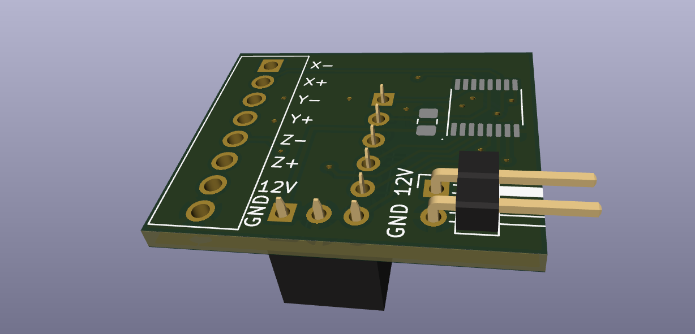

# Endstop BreakoutBoard

This breakoutboard needs to be placed into Rumba32 Endstop connector. It is a levelshifter for the 12 V Endstops. 

12V is supplied by Rumba32, you need to connect the 12V Pins of Rumba32 to J4 of this breakout board.

## Schematic

## BOM

| ld 	| Designator 	| Quantity 	| Comment           	| Manufacturer Part No 	| Link Digikey                                                                          	|
|----	|------------	|----------	|-------------------	|----------------------	|---------------------------------------------------------------------------------------	|
| 1  	| J1         	| 1        	| Screw Terminal    	| 691210910008         	| https://www.digikey.de/de/products/detail/w%C3%BCrth-elektronik/691210910008/11478428 	|
| 2  	| C1         	| 1        	| 10n               	| C0805C103K2RECAUTO   	| https://www.digikey.de/de/products/detail/kemet/C0805C103K2RECAUTO/8646745            	|
| 3  	| J4         	| 1        	| 2 Pin Header 2.54 	| 0022289020           	| https://www.digikey.de/de/products/detail/molex/0022289020/3158803                    	|
| 4  	| J3         	| 1        	| 3 Pin Header 2.54 	| 801-87-003-10-001101	| https://www.digikey.de/de/products/detail/preci-dip/801-87-003-10-001101/3757430      	|
| 5  	| J2         	| 1        	| 5 Pin Header 2.54 	| 801-87-005-10-001101 	| https://www.digikey.de/de/products/detail/preci-dip/801-87-005-10-001101/3757433      	|
| 6  	| IC1        	| 1        	| Buffer            	| 74HC4050PW,118       	| https://www.digikey.de/de/products/detail/nexperia-usa-inc/74HC4050PW-118/1230398     	|

