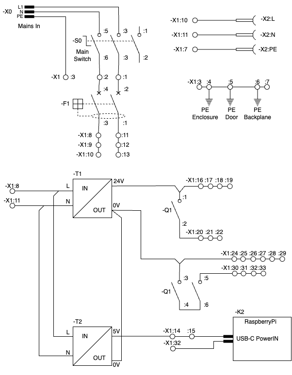
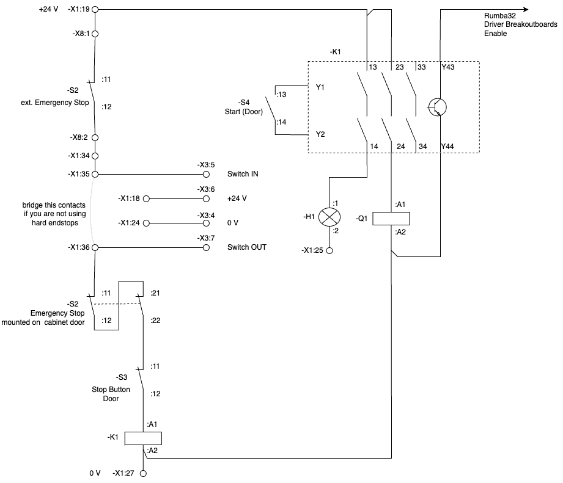
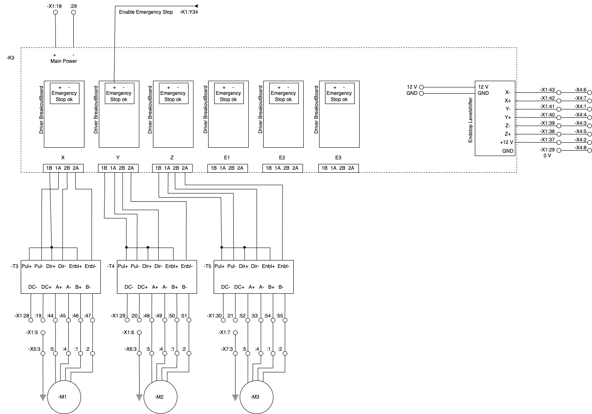
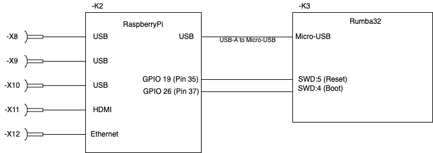

# Schematics and Terminal Plans

<!-- TOC -->

- [Schematics](#schematics)
    - [Power Distribution](#power-distribution)
    - [EmergencyStop](#emergencystop)
        - [Required Specs](#required-specs)
    - [Rumba32 and Motors](#rumba32-and-motors)
        - [NEMA color codes](#nema-color-codes)
    - [RaspberryPi](#raspberrypi)
- [Terminal Plans](#terminal-plans)
    - [X0](#x0)
    - [X1](#x1)
    - [X2](#x2)
    - [X3](#x3)
    - [X4](#x4)
    - [X5](#x5)
    - [X6](#x6)
    - [X7](#x7)
    - [X8](#x8)

<!-- /TOC -->

# Schematics

##  Power Distribution

The contactor $-Q1$ disconnects the motor drivers from the power supply in case of safe-torque-off (aka emergency stop). Schneider Electric has defined this way of wiring in an [application note](https://ckm-content.se.com/ckmContent/sfc/servlet.shepherd/document/download/0691H000008h5vrQAA). 

$-F1$ is an overcurrent protection with RCD. Depending to the eletcric installation of your lab and applicable regional laws it might be optional.

##  EmergencyStop

It is advisable (and most likely legal obligatory) having a safe-torque-off functionality according to EN-IS0 60204-1 so that the machine can be stopped in any cirumstance.  

### Required Specs
- Since the Rumba32 has no failsafe features (SIL-2 or above), the safe-torque-off must be implemented in dedicated hardware.
- to prevent unintended re-start of the drives, a dedicated safety-relais is used (-K1)
- since there are no stepper motor drivers availabe with suitable enable inputs (high-active and approved to EN-ISO 60204-1), their enable-inputs can not be used for a safe-torque-off function. So a suitable contactor (DC-3 operation for $20 \ A$ at $24 \ V_{DC}$) must be used to cut-off the power supply to the motor drivers in case of an emergency. This contactor must be selected carefully and wired according to the manufacturers guidelines to ensure safe operation.
- with some bad luck a cheap stepper motor driver can get killed by disrupting the power supply during operation due to the back-EMF of the motor. So a motor driver shall be disabled by the enable pin before interrupting the power supply connection. The used safety relais also has a NPN output which is switching faster than the mechanical relais-chain and afterwards the mechanical contactor. With this faster timing it ist possible to disable the motor driver by it´s enable input before the power gets lost. (switching off the machine by -S0 is always safe: the big $24 \ V$ power supply will slowly turn off the power and eventually take up most of the energy that might return from the drives.)
- The enable input of the motor drivers is used for disabling the drives while performing a field-measurement at an already reached location. This functionality is non safety-relevant, thus it can be implemented the easy way.

Hint: The safety-relay -K1 is not in production anymore. Changes to the schematic might be neccessary for a replecement of -K1. Please update this documentation when deploying another safety relais - thanks!

## Rumba32 and Motors

The [Rumba32](https://github.com/Aus3D/RUMBA32) is a 3D printer board. It is used for time-critical stuff e.g. generate the step and direction pulses for the stepper motor drivers.  
The Driver Breakoutboards are little custom PCBs plugged into the Rumba32, [here](../Rumba32/Driver_BreakoutBoard/README.md) is further documentation about them. 

### NEMA color codes

NEMA stepper motors usually have short color-coded wires. Unfortunately, there are multiple colorschemes used. However, some widely used color schemes are in the table below:

| Function  | scheme a  | scheme b  | cable core no | motor connector contact   |
| ----      | ----      | ----      | ----          | ---                       |
| A+        | black     |red        | 1             | :5                        |
| A-        | green     |green      | 2             | :4                        |
| B+        | red       |blue       | 3             | :1                        |
| B-        | blue      |yellow     | 4             | :2                        |
| PE/Shield | -         | -         | gn-yl         | :3                        |

Since the cores of the shielded motor cables are black, they have numbers as identifiers. The $cable \ core \ no$ in the table above is referring to the printed identifier on each core of the cable.

## RaspberryPi

# Terminal Plans

## X0
Mains In Connector (IEC-60320 C13/C14)

| Contact   | connected to  |
| ----      | ----          |
| L         | -S0:3         |
| N         | -S0:5         |
| PE        | -X1:3         |

## X1

|Contact #|Comment              |Bridged to contact |Left             |Right  |
|---------|---------------------|-------------------|-----------------|-------|
|1        | L Mains             | -                 | -F1:2           | -S0:3 |
|2        | N Mains             | -                 | -F1:4           | -S0:6 |
|3        | PE                  | PE DIN-rail       | -X1:23          | -X2:PE|
|4        | PE                  | PE DIN-rail       | -T1:PE          | -X0:PE|
|5        | PE                  | PE DIN-rail       | PE Enclosure    | -X5:3 |
|6        | PE                  | PE DIN-rail       | PE Door         | -X6:3 |
|7        | PE                  | PE DIN-rail       | PE Backplane    | -X7:3 |
|8        | L, fuesd            | 9                 | -T1:L           |       |
|9        | L, fused            | 8 + 10            |                 |       |
|10       | L, fused            | 9                 |                 | -X2:L |
|11       | N, fused            | 12                | T1:N            | -X2:N |
|12       | N, fused            | 11 + 13           |                 |       |
|13       | N, fused            | 12                |                 |       |
|14       | 5V                  | 15                | -T2:V+          |       |
|15       | 5V                  | 14                | -K2:USB-V+      |       |
|16       | 24 V                | 17                | -T1: +V         |       |
|17       | 24 V                | 16 + 18           | -T1: +V         |       |
|18       | 24 V                | 17 + 19           | -K3:+           | -X3:6 |
|19       | 24 V                | 18                | -K1:13          | -X8:1 |
|20       | 24 V switched       | 21                | -T3:DC+         | -Q1:2 |
|21       | 24 V switched       | 20 + 22           |  -T4:DC+        | -Q1:2 |
|22       | 24 V switched       | 21                | -T5:DC+         |       |
|23       | 0 V / PE            | 24                | -X1:3           |       |
|24       | 0 V                 | 23 + 25           | -T1:-V          | -X3:4 |
|25       | 0 V                 | 24 + 26           | -H1:2           |       |
|26       | 0 V                 | 25 + 27           | -T2:-           |       |
|27       | 0 V                 | 26 + 28           | -K1:A2          |       |
|28       | 0 V                 | 27 + 29           | -K2:USB-GND     |       |
|29       | 0 V                 | 28                | -K3:-           | -X4:8 |
|30       | 0 V switched        | 31                | -T3: DC-        | -Q1:L3|
|31       | 0 V switched        | 30 + 32           | -T4:DC-         | -Q1:L3|
|32       | 0 V switched        | 31 + 33           | -T5:DC-         |       |
|33       | 0 V switched        | 32                | -T6:DC-         |       |
|34       | ext. Emergency-Stop | 35                |                 | -X8:2 |
|35       | -                   | 34                |                 | -X3:5 |
|36       | Hard-Endstops       |                   | -S2:11          | -X3:7 |
|37       | 12 V Endstops       |                   | -K3:12V Endstops| -X4:2 |
|38       | Endstop Z+          |                   | -K3:Z+          | -X4:5 |
|39       | Endstop Z-          |                   | -K3:Z-          | -X4:3 |
|40       | Endstop Y+          |                   | -K3:Y+          | -X4:4 |
|41       | Endstop Y-          |                   | -K3:Y-          | -X4:1 |
|42       | Endstop X+          |                   | -K3:+           | -X4:7 |
|43       | Endstop X-          |                   | -K3:-           | -X4:6 |
|44       | -M1:A+              |                   | -T3:A+          | -X5:5 |
|45       | -M1:A-              |                   | -T3:A-          | -X5:4 |
|46       | -M1:B+              |                   | -T3:B+          | -X5:1 |
|47       | -M1:B-              |                   | -T3:B-          | X5:2  |
|48       | -M2:A+              |                   | -T4:A+          | -X6:5 |
|49       | -M2:A-              |                   | -T4:A-          | -X6:4 |
|50       | -M2:B+              |                   | -T4:B+          | -X6:1 |
|51       | -M2:B-              |                   | -T4:B-          | X6:2  |
|52       | -M3:A+              |                   | -T5:A+          | -X7:5 |
|53       | -M3:A-              |                   | -T5:A-          | -X7:4 |
|54       | -M3:B+              |                   | -T5:B+          | -X7:1 |
|55       | -M3:B-              |                   | -T5:B-          | -X7:2 |
|56       |                     |                   |                 |       |
|57       |                     |                   |                 |       |
|58       |                     |                   |                 |       |
|59       |                     |                   |                 |       |
|60       |                     |                   |                 |       |
|61       |                     |                   |                 |       |
|62       |                     |                   |                 |       |
|63       |                     |                   |                 |       |

The contacts 56 to 63 are reserved for future upgrades, e.g. additional axis.

## X2

External Power Socket

| Contact   | connected to  |
| ----      | ----          |
| L         | -X1:10        |
| N         | -X1:11        |
| PE        | -X1:7         |

## X3
Hard-Endstops Connector

| Contact | Comment    | Connected To |
|---------|------------|--------------|
| 1       | -          | -            |
| 2       | -          | -            |
| 3       | -          | -            |
| 4       | 0 V        | -X1:24       |
| 5       | Switch IN  | -X1:35       |
| 6       | 24 V       | -X1:18       |
| 7       | Switch OUT | -X1:36       |
| 8       | -          | -            |

## X4
Endstops Connector

| Contact | Comment | Connected To |
|---------|---------|--------------|
| 1       | Y-      | -X1:41       |
| 2       | +12 V   | -X1:37       |
| 3       | Z-      | -X1:39       |
| 4       | Y+      | -X1:40       |
| 5       | Z+      | -X1:38       |
| 6       | X-      | -X1:43       |
| 7       | X+      | -X1:42       |
| 8       | 0 V     | -X1:29       |

## X5
Motor X-Axis Connector

| Contact | Comment     | Connected To |
|---------|-------------|--------------|
| 1       | B+          | -X1:46       |
| 2       | B-          | -X1:47       |
| 3       | PE & Shield | -X1:5        |
| 4       | A-          | -X1:45       |
| 5       | A+          | -X1:44       |
| 6       | -           | -            |

## X6
Motor Y-Axis Connector

| Contact | Comment     | Connected To |
|---------|-------------|--------------|
| 1       | B+          | -X1:50       |
| 2       | B-          | -X1:51       |
| 3       | PE & Shield | -X1:6        |
| 4       | A-          | -X1:49       |
| 5       | A+          | -X1:48       |
| 6       | -           | -            |

## X7
Motor Z-Axis Connector

| Contact | Comment     | Connected To |
|---------|-------------|--------------|
| 1       | B+          | -X1:54       |
| 2       | B-          | -X1:55       |
| 3       | PE & Shield | -X1:7        |
| 4       | A-          | -X1:53       |
| 5       | A+          | -X1:52       |
| 6       | -           | -            |

## X8
External Emergency Stop Connector

| Contact | Comment     | Connected To |
|---------|-------------|--------------|
| 1       | +24 V   	| -X1:19       |
| 2       | Switch Out  | -X1:34       |
| 3       | - 			| -            |