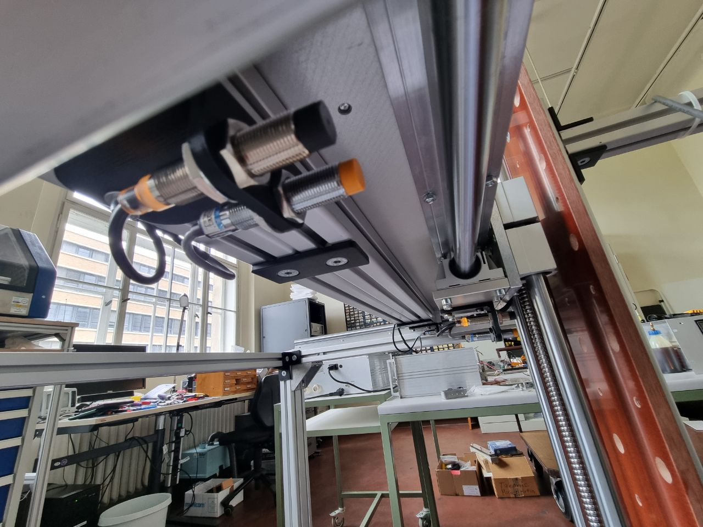
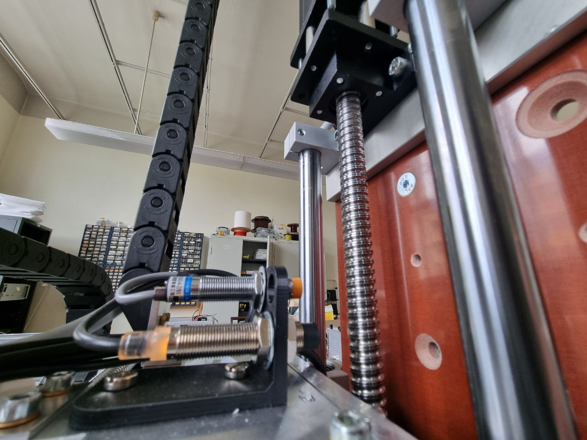

# Mechanical System

Here you can find all necessary files to reproduce the COSI Measure mechanical setup.

Please read the assembly documentation first, in particular you will find some known issues or useful ideas in the comments section, which will help you reproducing the design.

## Folder: Aluplates
3D CAD models and technical drawings of the individual components.

## Folder: Complete System
3D CAD model of the complete system.

## Folder: Limit switch holder
3D CAD models of the limit switch holders

Please note that the following assembly instruction has not been updated yet to the new limit switch holders. For the new design refer to this pictures:

The outer limit switch is triggering the safe-torque-off (aka emergency stop). Thus the machine can not kill itself no matter what the software is trying to execute.

## Files: *_BoM_mechanical.ods and *_BoM_mechanical.pdf
Bill of material file for the mechanical setup. The .ods file can be opened with LibreOffice Calc (https://www.libreoffice.org/, the open source counterpart to Excel)

## Files: *_mechanical_assembly_instructions.odt and *_mechanical_assembly_instructions.pdf
Mechanical step by step assembly documentation. The .odt file can be opened with LibreOffice Writer (https://www.libreoffice.org/, the open source counterpart to Word).
