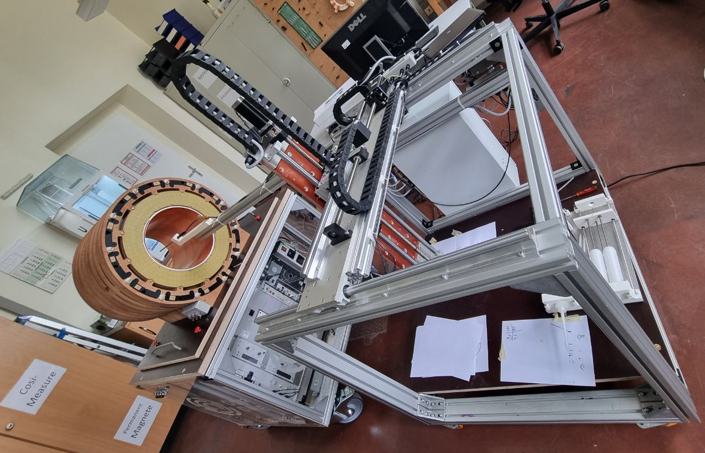

# COSI Measure

<!-- TOC -->

- [COSI Measure](#cosi-measure)
    - [Description](#description)
    - [System specifications](#system-specifications)
    - [Versions and Branches](#versions-and-branches)
    - [Contacts](#contacts)
        - [Known builds](#known-builds)
    - [Contributors alphabetical order](#contributors-alphabetical-order)
    - [Publications](#publications)
    - [Acknowledgments](#acknowledgments)
    - [License and Liability](#license-and-liability)

<!-- /TOC -->
## Description

COSI Measure is an open source multipurpose 3-axis robot operating in a large volume, that can be equipped with e.g. field mapping probes for static or dynamic field measurements (electromagnetic, temperature etc.). Submillimeter fidelity and reproducibility/backlash performance were evaluated experimentally. It can be potentially upgraded to be used as a CNC, for 3D printing or other applications, that require reproducible submillimeter movements.

## System specifications 

- Dimension: (80x90x105)cm³
- Working volume: (53x53x64)cm³
- Precision: positioning error <1mm
- Max load: ~20kg
- Applied force: 896N (91kg)
- Standalone system
- Inductive limit switches
- Emergency Stop
- Open Source Software GUI (Python)
- Estimated material costs: ~2000€

More photos and videos can be found on opensourceimaging.org: https://www.opensourceimaging.org/project/cosi-measure/ 

## Versions and Branches

- 1.0
    - Electronics based on Beagle Bone Black and BeBoPr++
    - outdated
- 2.0
    - Electronics changed to Rasperry Pi and Rumba32
    - Other simplifications e.g. in the power management board
    - Up to 6x stepper motor drivers
    - Improved safety concept with hardware safe-torque-off and soft and hard limit switches
    - New software

## Contacts

General contact:
Name | Email | Institution | COSI Measure Applications
-----|-----|-----|-----|
Lukas Winter | lukas.winter@ptb.de | Physikalisch-Technische Bundesanstalt (PTB), Berlin, Germany | Magnetic field mapping of MR magnets, implant safety measurements, RF field mapping of RF coils using time-domain H- and E-field sensors, Measurements within an MR scanner, 3D printing

### (Known) builds
Name | Email | Institution | COSI Measure Applications
-----|-----|-----|-----|
Haopeng Han | haopeng.han@mdc-berlin.de | Max-Delbrück Center for Molecular Medicine, Berlin, Germany | Temperature and RF field mapping of RF coils
Tom O'Reilly | t.o_reilly@lumc.nl | Leiden University Medical Center (LUMC), Leiden, Netherlands | Magnetic field mapping of low field MR magnets
Benjamin Menküc | benjamin.menkuec@fh-dortmund.de | University of Applied Sciences, Dortmund, Germany | Magnetic field mapping of low field MR magnets
Mark Bason | M.Bason@sussex.ac.uk | Quantum Systems and Devices, University of Sussex, Falmer, England | Magnetic field measurements
Wolfgang Kilian | Wolfgang.Kilian@ptb.de | Physikalisch-Technische Bundesanstalt (PTB), Berlin, Germany | 3D printing of phantoms

## Contributors (alphabetical order)
Nils Allek, Mark Bason, Jan Gregor Frintz, Haopeng Han, Amjad Kasabashy, Wolfgang Kilian, Ilia Kulikov, Benjamin Menküc, Tobias Mohr, Reiner Montag, Tom O'Reilly, David Shiers, Berk Silemek, Karl Stupic, Lukas Winter

## Publications
If you find this useful in your work, please cite:
[H. Han, R. Moritz, E. Oberacker, H. Waiczies, T. Niendorf and L. Winter, "Open Source 3D Multipurpose Measurement System with Submillimetre Fidelity and First Application in Magnetic Resonance", Scientific Reports, 7:13452, 2017](www.nature.com/articles/s41598-017-13824-z)

## Acknowledgments

This work is supported by the Open Source Imaging Initiative (OSI²), https://www.opensourceimaging.org/project/cosi-measure/

The project (21NRM05) has received funding from the European Partnership on Metrology, co-financed by the European Union's Horizon Europe Research and Innovation Programme and by the Participating States.

## License and Liability
The content in this repository is licensed under the CERN Open Hardware Licence Version 2 - Weakly Reciprocal, please see [LICENSE](LICENSE) for details and also check the [DISCLAIMER](DISCLAIMER.pdf)
